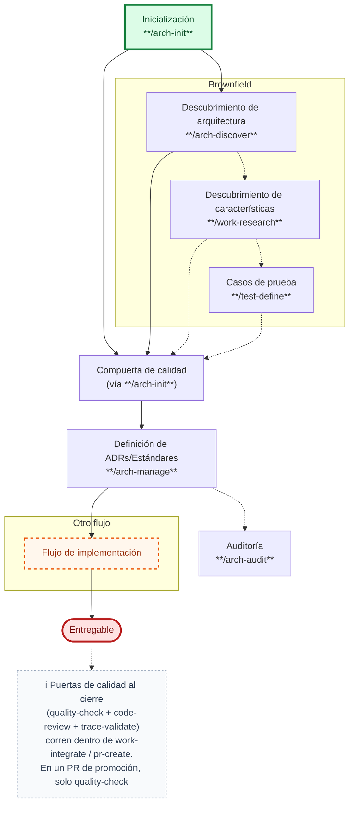
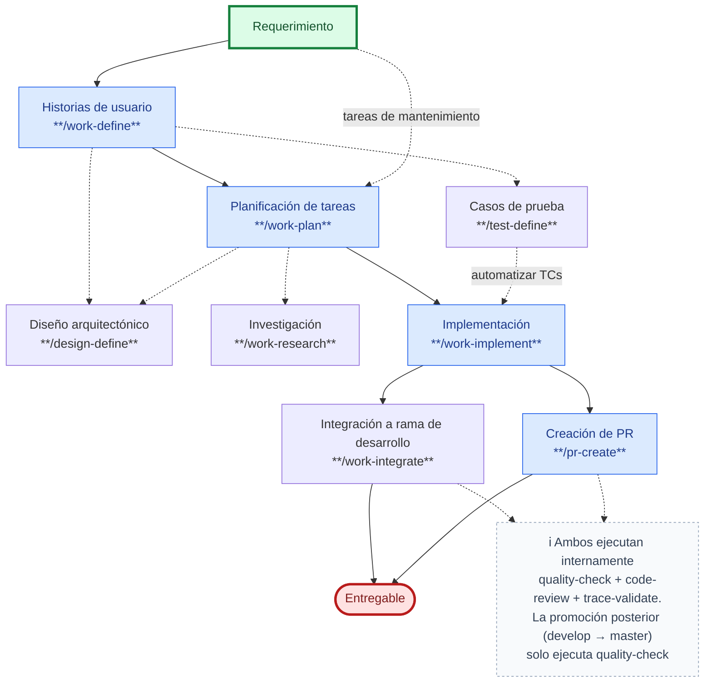
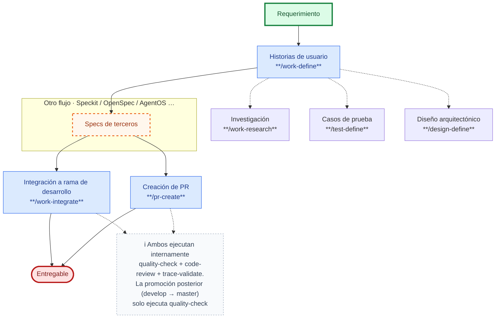

# SDD Devkit

**SDD Devkit** (`sdd-devkit`) es un conjunto de skills para practicar Spec-Driven Development: parte de un requerimiento, lo convierte en documentación viva (historias de usuario, ADRs/estándares, diseño técnico, casos de prueba) y guía la implementación paso a paso hasta un entregable verificado. Cubre:

- Documentación de arquitectura: ADRs, estándares y auditoría de cumplimiento.
- Historias de usuario, planificación e implementación de tareas técnicas y tareas de mantenimiento.
- Definición y trazabilidad de casos de prueba.
- Investigación de producto, arquitectura o técnica (incluida migración entre proyectos).
- Code review, integración y creación de PR con puertas de calidad.


## Instalación

Ver la [guía de instalación](INSTALL.md) para Cursor y Claude Code.

## Estructura del plugin

```
sdd-devkit/
├── skills/         # un skill por carpeta: SKILL.md + references/ + assets/
├── agents/         # subagentes especializados (docs, ui, quality)
└── reference/      # reglas transversales compartidas por varios skills
```

La carpeta [`reference/`](reference/) es la **fuente única** de lo que aplica a todo el catálogo —
resolución de idioma, mecanismo de preguntas al usuario, rutas e identificadores de artefactos e
integración con Azure DevOps. Los skills la referencian con rutas relativas (`../../reference/…`) en
vez de repetir el contenido, y declaran solo su delta. Índice completo en
[`reference/README.md`](reference/README.md).

> Las referencias son relativas a propósito: funcionan en GitHub, en un editor y en cualquier agente.
> Lo que no funciona es copiar un skill sin la carpeta `reference/` al lado.

## Configuración del proyecto (`.sdd-devkit/settings.json`)

`arch-init` crea este archivo en la raíz de **cada proyecto** que adopta el harness (no en el plugin). Controla el idioma de los artefactos, la ruta base y de archivado de las especificaciones, si `work-define`/`work-plan` ofrecen o invocan `test-define` al llegar a Ready, el ritmo de confirmaciones e implementación (cambios sin commitear, worktrees, paralelismo, archivado, handoff de cierre), el comportamiento de `git-commit` (si confirma la división en varios commits y si hace push, y con qué política), qué puertas de verificación ejecuta `work-integrate` antes del merge y si piden autorización antes de corregir lo que encuentren, y la integración opcional con gestión de proyectos y el seguimiento de specs. Esquema completo en [`schemas/settings.schema.json`](schemas/settings.schema.json).

Ejemplo con las integraciones activadas:

```json
{
  "language": "es",
  "specification": {
    "basePath": "docs/specs/",
    "archivePath": "docs/archive/",
    "trackingEnabled": true,
    "trackingUrl": "https://events.sdd.io/api/v1/events",
    "testCases": { "mode": "ask", "askDetails": true }
  },
  "implementation": {
    "confirmByUnit": "always",
    "uncommittedChanges": "ask",
    "workTree": "ask",
    "workTreePath": "../worktrees",
    "maxParallel": 3,
    "archiveMode": "ask",
    "handoff": "ask"
  },
  "verification": {
    "qualityCheck": {
      "enabled": true,
      "confirmFix": "always"
    },
    "codeReview": {
      "enabled": true,
      "confirmFix": "always"
    },
    "requirementCoverage": {
      "enabled": true,
      "confirmFix": "always"
    },
    "handoff": "ask"
  },
  "git": {
    "commitConfirmation": "always",
    "push": "ask",
    "integrationBranches": []
  },
  "projectManagement": {
    "enabled": true,
    "provider": "azure-devops",
    "host": "https://dev.azure.com/mi-organizacion",
    "workspace": "mi-organizacion",
    "project": "MiProyecto"
  }
}
```

Con las integraciones desactivadas —el mínimo que genera `arch-init` por defecto— `projectManagement` queda en `"enabled": false` sin el resto de sus campos, y `specification` omite `trackingUrl` con `trackingEnabled: false`. Ver la plantilla en [`skills/arch-init/assets/settings-template.json`](skills/arch-init/assets/settings-template.json).

## Skills incluidos

Detalle de uso, opciones y handoffs de cada skill: [SKILLS.md](SKILLS.md).

### Harness

Skills que sostienen el andamiaje del repo (arquitectura y control de versiones), independientes de qué requerimiento se esté trabajando.

Un **harness** es el "andamiaje" que sostiene y guía todo el proceso de desarrollo: el conjunto de skills, plantillas y puertas de calidad conectados entre sí para que un requerimiento avance de forma ordenada y repetible desde la idea hasta el código en producción — en vez de depender de que cada persona improvise su propio camino. En SDD Devkit, el harness es el recorrido completo (arquitectura → pruebas → implementación → verificación) que conecta los skills de este repo en un flujo único.


| Skill                                    | Uso                                                                                                                                                                                                                                                                                                                                                                      |
| ---------------------------------------- | ------------------------------------------------------------------------------------------------------------------------------------------------------------------------------------------------------------------------------------------------------------------------------------------------------------------------------------------------------------------------ |
| [arch‑init](SKILLS.md#arch-init)         | Inicializar el harness de un proyecto (nuevo o existente): repo git, diagnóstico base limpia/con características implementadas, stack tecnológico (detectado o investigado y scaffolded), placeholders `AGENTS.md`/`CLAUDE.md`/`.agents/MEMORY.md`/`.sdd-devkit/settings.json`/`docs/adr/README.md`/`docs/standards/README.md`, compuerta de calidad y los primeros ADR/estándares vía `arch-manage` |
| [arch‑manage](SKILLS.md#arch-manage)     | Crear o actualizar ADRs (decisiones, en `docs/adr/`) y estándares de arquitectura **por dominio** (en `docs/standards/`, p. ej. *Testing Standards*), en la raíz del repositorio al que pertenece el código —principal o submódulo.                                                                                                                                       |
| [arch‑discover](SKILLS.md#arch-discover) | Analizar un repositorio y proponer ADRs y criterios de cumplimiento candidatos, agrupados por estándar de dominio, a partir de decisiones y reglas implícitas                                                                                                                                                                                                            |
| [arch‑audit](SKILLS.md#arch-audit)       | Auditar los **criterios de cumplimiento** de los estándares (`docs/standards/`) y de `AGENTS.md` contra el estado real del repo — criterio por criterio, citando el ADR de origen — y generar un informe priorizado en el `docs/audits/` de la raíz auditada (una por corrida), con revalidaciones incrementales                                                          |
| [git‑commit](SKILLS.md#git-commit)       | Preparar commits con mensajes Conventional Commits inferidos del diff                                                                                                                                                                                                                                                                                                    |


#### Flujo del harness

Vista de alto nivel del harness. El punto de entrada único es `arch-init`: identifica el punto de partida del proyecto, inicializa el harness y, según corresponda, deriva al descubrimiento brownfield y a la compuerta de calidad. Desde ahí se entra a la implementación de requerimientos (otro flujo, detallado en Specs) y a las mismas puertas de cierre.




1. **Inicio**: todo arranca con `arch-init` (harness, stack y diagnóstico del punto de partida).
2. Si el proyecto ya tiene implementación, `arch-init` deriva al **Brownfield**: descubrimiento de arquitectura con `arch-discover` y, opcionalmente, características con `work-research` y casos de prueba con `test-define`.
3. En paralelo (o a continuación), se configura la **compuerta de calidad** vía `arch-init`; el camino brownfield también converge ahí.
4. Luego se definen o actualizan los ADRs/Estándares con `arch-manage`. Opcionalmente se audita el cumplimiento con `arch-audit`.
5. Con la base arquitectónica lista, el trabajo entra a la implementación de requerimientos (otro flujo: historias → planificación → implementación → integración/PR).
6. Ese flujo de implementación **ya cierra** con `work-integrate` o `pr-create`, que ejecutan internamente las puertas de calidad (`quality-check`, `code-review`, `trace-validate`) y, pasadas todas, ofrecen archivar el artefacto en `docs/archive/` —solo si el usuario lo confirma; declinarlo no bloquea el cierre— no son pasos aparte de este flujo de alto nivel. Y un paso más allá queda la **promoción**: `pr-create` desde `develop` hacia la rama de despliegue, donde solo aplica `quality-check` porque cada trabajo ya pasó las tres al integrarse.
7. El flujo termina en un entregable: trabajo verificado, validado y listo para producción.


### Specs

Skills del ciclo de vida de un requerimiento: de la historia de usuario al PR mergeado. Es el camino concreto que sigue un requerimiento hasta convertirse en código verificado — la parte "central" del harness, que se repite en cada requerimiento dentro de la base arquitectónica ya definida.


| Skill                                      | Uso                                                                                                                                                                                                                                                                                               |
| ------------------------------------------ | ------------------------------------------------------------------------------------------------------------------------------------------------------------------------------------------------------------------------------------------------------------------------------------------------- |
| [work‑research](SKILLS.md#work-research)   | Investigar y sintetizar en un informe (RS-XXX). Genérico con seis flujos: investigación libre (producto, arquitectura, técnica o cambio), analizar decisiones pendientes (US/TK/WI → lagunas y decisiones por tomar), analizar issue (defecto → reproducción, causa raíz, diagnóstico de pruebas y WI de corrección), analizar test case (TC-XXX → auditoría y veredicto), analizar legado (código sin requisitos → FT-XXX) y analizar migración (origen→destino → discovery y validación) |
| [work‑define](SKILLS.md#work-define)       | Crear o actualizar historias de usuario (US-XXX)                                                                                                                                                                                                                                                  |
| [design‑define](SKILLS.md#design-define)   | Crear o actualizar documentación técnica (modelos de datos, APIs/endpoints, flujos, diagramas de clases/C4) en `docs/specs/technical-docs/` como referencia de implementación                                                                                                                     |
| [test‑define](SKILLS.md#test-define)       | Crear casos de prueba (TC-XXX) desde los criterios de aceptación de una US, un WI o un feature ya implementado (FT-XXX) (IEEE 29119-4)                                                                                                                                                            |
| [work‑plan](SKILLS.md#work-plan)           | Planificar tareas técnicas (TK-XXX) o tareas de mantenimiento (WI-XXX)                                                                                                                                                                                                                            |
| [work‑implement](SKILLS.md#work-implement) | Implementar en código specs en estado Ready: tareas técnicas (TK-XXX) o de mantenimiento (WI-XXX) → funcionalidad; casos de prueba (TC-XXX) o features ya implementados (FT-XXX) → pruebas automatizadas                                                                                          |
| [quality‑check](SKILLS.md#quality-check)   | Verificaciones automatizadas pre-merge según el stack (tipado, linter, unit, coverage, build, e2e, sonar) más las suites que declare el estándar de testing, con veredicto apto/no apto/incompleto                                                                                                                                                  |
| [code‑review](SKILLS.md#code-review)       | Revisión cualitativa pre-merge del diff: intención, arquitectura y diseño (ISO/IEC 25010, SOLID) con feedback accionable y veredicto apto/no apto/incompleto                                                                                                                                      |
| [trace‑validate](SKILLS.md#trace-validate) | Reporte de trazabilidad: criterios de aceptación de US/WI/FT ↔ casos y artefactos de prueba, con veredicto de cobertura                                                                                                                                                                           |
| [work‑integrate](SKILLS.md#work-integrate) | Cerrar e integrar el trabajo de una US, un WI o una automatización de pruebas                                       |
| [pr‑create](SKILLS.md#pr-create)           | Crear PR o MR desde la rama actual (GitHub, GitLab, Azure Repos, etc.) con puertas de calidad obligatorias. Dos modos: implementación (feature → integración; quality-check, code-review, trace-validate y Definition of Done) y promoción (develop → master/release; quality-check y DoD)                                                                                                                                      |


#### Flujo de implementación

**Ventajas de seguir este flujo:**

- **Trazabilidad de punta a punta**: cada línea de código puede rastrearse hasta la historia de usuario y el criterio de aceptación que la originó.
- **Calidad consistente**: toda entrega pasa por las mismas puertas (`quality-check`, `code-review`, `trace-validate`) sin importar quién la implemente.
- **Menos retrabajo**: los pasos opcionales (casos de prueba, diseño técnico, investigación) se activan solo cuando aportan valor, evitando documentación innecesaria pero sin perder cobertura cuando sí se necesita.
- **Handoffs claros**: cada skill tiene una entrada y salida bien definidas, así que el trabajo se puede pausar y retomar (o pasar a otra persona) sin perder contexto.

Los pasos con línea punteada en el diagrama son opcionales.




1. **Inicio**: un requerimiento se convierte en historias de usuario con `work-define`. Si son tareas de mantenimiento, el requerimiento entra directo a **Planificación de tareas** (`work-plan`) —nota en la línea del diagrama—.
2. Opcionalmente, desde las historias se definen casos de prueba (`test-define`) y/o diseño arquitectónico (`design-define`).
3. **Planificación de tareas** (`work-plan`): desde una historia produce tareas técnicas (`TK-XXX`); sin historia, tareas de mantenimiento (`WI-XXX`).
4. Durante la planificación, opcionalmente se investiga con `work-research` y/o se ajusta el diseño arquitectónico con `design-define`.
5. Las tareas planificadas pasan a `work-implement` para su codificación. Los casos de prueba (`TC-XXX`, incluidos los de un feature legacy `FT-XXX`) también pueden pasar por `work-implement` para automatizarse como pruebas.
6. El flujo termina por uno de dos caminos, y ambos llegan al mismo entregable — el trabajo listo para producción, ya sea integrado directo (`work-integrate`) o vía Pull/Merge Request (`pr-create`). Cada uno ejecuta **internamente** las mismas puertas de calidad (`quality-check`, `code-review`, `trace-validate`) y, una vez aprobadas, **pregunta si archivar el `US-XXX`/`WI-XXX`**; si el usuario confirma, mueve su carpeta a `docs/archive/` en la misma rama para que el archivado se integre con el código. Declinarlo no bloquea el cierre. No son pasos aparte de este flujo. Después, promover lo acumulado en `develop` a la rama de despliegue es un `pr-create` en **modo promoción**, que solo ejecuta `quality-check`.


#### Specs (frameworks de terceros)

Variante del flujo Specs **cuando la implementación la ejecuta un framework de terceros** (p. ej. Speckit, OpenSpec, AgentOS): se especifican las historias y el entregable de specs, sin pasar por planificación ni implementación propias del harness.




1. **Inicio**: el requerimiento se convierte en historias de usuario con `work-define`.
2. Opcionalmente, desde las historias se investiga (`work-research`), se definen casos de prueba (`test-define`) y/o diseño arquitectónico (`design-define`).
3. Las historias alimentan **Specs de terceros** (la implementación la corre el framework elegido: Speckit, OpenSpec, AgentOS, etc.).
4. El flujo termina por uno de dos caminos, igual que en Specs: integración directa (`work-integrate`) o vía Pull/Merge Request (`pr-create`); ambos llegan al entregable, ejecutan **internamente** las mismas puertas de calidad (`quality-check`, `code-review`, `trace-validate`) y ofrecen archivar el artefacto en `docs/archive/` previa confirmación del usuario —que puede declinarla sin bloquear el cierre—, sin ser pasos aparte de este flujo. La promoción posterior a la rama de despliegue es un `pr-create` en **modo promoción**, que solo ejecuta `quality-check`.


## Nivel de responsabilidades

El humano define la intención, las restricciones y las decisiones importantes; el agente decide los detalles de implementación dentro de esos límites.


| Nivel                     | Lo define normalmente  | Asistido por IA                    |
| ------------------------- | ---------------------- | ---------------------------------- |
| Problema de negocio       | Humano / Product Owner | `/work-define`                     |
| Comportamiento esperado   | Humano / Desarrollador | `/work-plan` o Spec Framework      |
| Casos de prueba           | Humano / QA            | `/test-define`                     |
| UX/UI (cómo debe verse)   | Humano / Diseñador     | —                                  |
| Modelo de dominio / datos | Humano / Arquitecto    | `/design-define`                   |
| Arquitectura              | Humano / Arquitecto    | `/arch-manage`                     |
| Validación de criterios de aceptación | Humano / QA | `/trace-validate`                  |
| Implementación detallada  | Agente                 | `/work-implement` o Spec Framework |


## Casos de uso

Recorridos end-to-end concretos que combinan varios skills, con el flujo completo (incluida la rama de decisión) para una situación específica.

| Caso de uso | Descripción |
| ----------- | ----------- |
| [Fix a bug](docs/use-cases/fix-a-bug.md) | Corrección de un defecto: diagnóstico (`work-research`) → según se localice o no la causa raíz, planificación (`work-plan`) e implementación (`work-implement`) o análisis humano → puertas de calidad → integración/PR |
| [Refactorización de código](docs/use-cases/refactor.md) | Refactor de código existente: investigación de factibilidad e impacto (`work-research`) → según sea factible o no, resolución de prerequisitos opcionales (ADR/estándares, dependencias) y planificación/implementación del refactor (`work-plan`/`work-implement`), o análisis humano y reinicio de la investigación con alcance redefinido → puertas de calidad → integración/PR |
| [Tarea de mantenimiento](docs/use-cases/maintenance-task.md) | Caso genérico sin historia de usuario (deuda técnica, dependencias, seguridad, operativa…): planificación (`work-plan`) directa desde el requerimiento, sin pasar por `work-define` → implementación (`work-implement`) → puertas de calidad → integración/PR |
| [Cobertura de pruebas en código existente](docs/use-cases/test-coverage-legacy-code.md) | Código legado sin requisitos ni pruebas: descubrimiento de features por ingeniería inversa (`work-research`) → casos de prueba (`test-define`) → implementación de las pruebas (`work-implement` sobre `docs/specs/features`) → puertas de calidad → PR |

## Contribuir

Las contribuciones son bienvenidas. Antes de abrir un issue o un Pull Request, lee la [guía de contribución](CONTRIBUTING.md).

## Licencia

Este proyecto es de código abierto y se distribuye bajo la licencia [MIT](LICENSE).