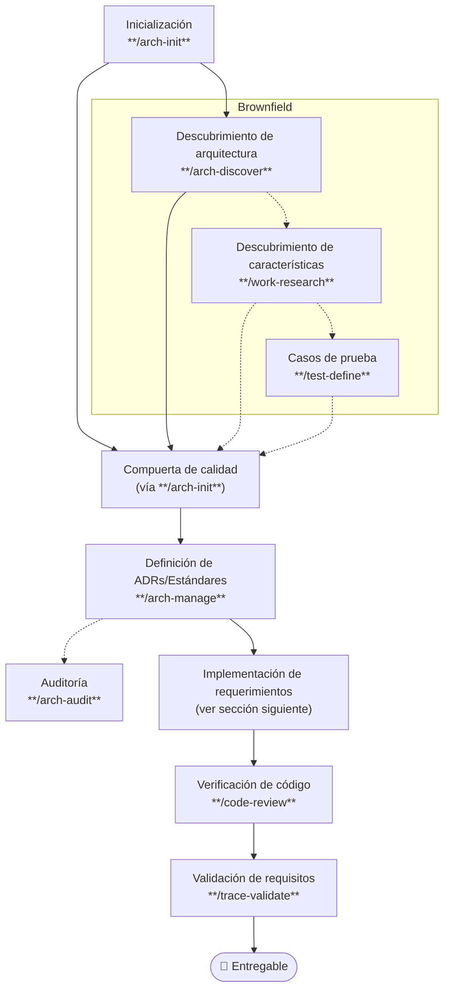
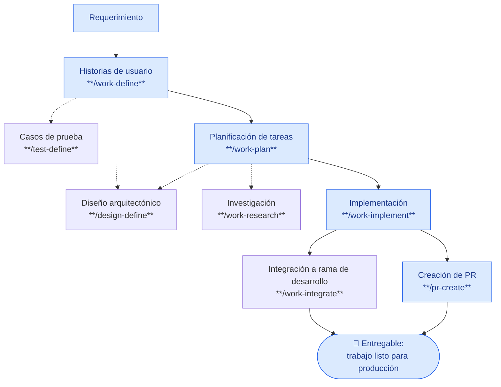

# SDD Devkit

**SDD Devkit** (`sdd-devkit`) es un conjunto de skills para practicar Spec-Driven Development: parte de un requerimiento, lo convierte en documentación viva (historias de usuario, ADRs/estándares, diseño técnico, casos de prueba) y guía la implementación paso a paso hasta un entregable verificado. Cubre:

- Documentación de arquitectura: ADRs, estándares y auditoría de cumplimiento.
- Historias de usuario, planificación e implementación de tareas técnicas y work items de mantenimiento.
- Definición y trazabilidad de casos de prueba.
- Investigación de producto, arquitectura o técnica (incluida migración entre proyectos).
- Code review, integración y creación de PR con puertas de calidad.

## Instalación

Ver la [guía de instalación](INSTALL.md) para Cursor y Claude Code.

## Skills incluidos

| Skill | Uso |
|-------|-----|
| `arch-init` | Inicializar el harness de un proyecto (nuevo o existente): repo git, diagnóstico base limpia/con características implementadas, stack tecnológico (detectado o investigado y scaffolded), placeholders `AGENTS.md`/`CLAUDE.md`/`.agents/MEMORY.md`/`docs/adr/README.md`/`docs/standards/README.md`, compuerta de calidad y los primeros ADR/estándares vía `arch-manage` |
| `arch-manage` | Crear o actualizar ADRs (decisiones, en `docs/adr/`) y estándares de arquitectura **por dominio** (en `docs/standards/`, p. ej. *Testing Standards*). Cada decisión añade un **requisito** — redactado con RFC 2119/8174 (MUST/SHOULD/MAY) — al estándar del dominio que corresponda; el ADR lo referencia (`emits`) y el estándar traza a sus decisiones (`source_adrs`). Las fitness functions cuelgan de cada requisito |
| `arch-discover` | Analizar un repositorio y proponer ADRs y requisitos candidatos, agrupados por estándar de dominio, a partir de decisiones y reglas implícitas |
| `arch-audit` | Auditar el cumplimiento de los **requisitos** de los estándares (`docs/standards/`) y de `AGENTS.md` contra el estado real del repo — requisito por requisito, según su término RFC 2119, citando el ADR de origen — y generar un informe priorizado en `docs/audits/` con revalidaciones incrementales |
| `code-review` | Revisión de código pre-merge: verificaciones automatizadas según el stack + revisión cualitativa (arquitectura, diseño, SOLID), con veredicto apto/no apto/incompleto |
| `design-define` | Crear o actualizar documentación técnica (modelos de datos, APIs/endpoints, flujos, diagramas de clases/C4) en `docs/specs/technical-docs/` como referencia de implementación |
| `git-commit` | Preparar commits con mensajes Conventional Commits inferidos del diff |
| `pr-create` | Crear PR o MR desde la rama actual (GitHub, GitLab, Azure Repos, etc.) con puertas de calidad obligatorias: code-review, trace-validate y Definition of Done |
| `test-define` | Crear casos de prueba (TC-XXX) desde los criterios de aceptación de una US o WI (IEEE 29119-4) |
| `trace-validate` | Reporte de trazabilidad: criterios de aceptación de US/WI ↔ casos y artefactos de prueba, con veredicto de cobertura |
| `work-research` | Investigar y sintetizar en un informe (RS-XXX). Genérico con tres flujos: artefacto (US/TK/WI → lagunas y decisiones pendientes), migración (origen→destino → discovery y validación, con handoff a `work-define` o `work-plan`) e investigación libre (producto, arquitectura, técnica o cambio) |
| `work-define` | Crear o actualizar historias de usuario (US-XXX) |
| `work-plan` | Planificar tareas técnicas (TK-XXX) o work items de mantenimiento (WI-XXX) |
| `work-implement` | Implementar tareas (TK-XXX) o work items (WI-XXX) a partir de specs en estado Ready |
| `work-integrate` | Cerrar e integrar el trabajo de una US o WI (merge de la rama feature previa verificación en `progress.md`) |

## Definición de harness

Un **harness** es el "andamiaje" que sostiene y guía todo el proceso de desarrollo: el conjunto de skills, plantillas y puertas de calidad conectados entre sí para que un requerimiento avance de forma ordenada y repetible desde la idea hasta el código en producción — en vez de depender de que cada persona improvise su propio camino. En SDD Devkit, el harness es el recorrido completo (arquitectura → pruebas → implementación → verificación) que conecta los skills de este repo en un flujo único.

A continuación, la vista de alto nivel de cómo se usa el harness completo. El punto de entrada único es **`arch-init`**: identifica el punto de partida del proyecto, inicializa el harness y, según corresponda, deriva al descubrimiento brownfield y a la compuerta de calidad. Desde ahí se llega a la [implementación de requerimientos](#implementación-de-requerimientos) y a las mismas puertas de cierre.

1. **Inicio**: todo arranca con `arch-init` (harness, stack y diagnóstico del punto de partida).
2. Si el proyecto ya tiene implementación, `arch-init` deriva al **Brownfield**: descubrimiento de arquitectura con `arch-discover` y, opcionalmente, características con `work-research` y casos de prueba con `test-define`.
3. En paralelo (o a continuación), se configura la **compuerta de calidad** vía `arch-init`; el camino brownfield también converge ahí.
4. Luego se definen o actualizan los ADRs/Estándares con `arch-manage`. Opcionalmente se audita el cumplimiento con `arch-audit`.
5. Con la base arquitectónica lista, el trabajo entra a la [implementación de requerimientos](#implementación-de-requerimientos) (historias → planificación → implementación → integración/PR).
6. El código resultante pasa por verificación (`code-review`) y validación de requisitos (`trace-validate`).
7. El flujo termina en un entregable: trabajo verificado, validado y listo para producción.

## Implementación de requerimientos

Es el camino concreto que sigue un requerimiento desde que se escribe hasta que se convierte en código verificado y listo para producción: se documenta como historia de usuario, se descompone en tareas, se codifica y se cierra con una integración o un Pull Request. Es la parte "central" del harness — la que se repite en cada requerimiento, dentro de la base arquitectónica que ya dejó definida el harness.

**Ventajas de seguir este flujo:**

- **Trazabilidad de punta a punta**: cada línea de código puede rastrearse hasta la historia de usuario y el criterio de aceptación que la originó.
- **Calidad consistente**: toda entrega pasa por las mismas puertas (`code-review`, `trace-validate`) sin importar quién la implemente.
- **Menos retrabajo**: los pasos opcionales (casos de prueba, diseño técnico, investigación) se activan solo cuando aportan valor, evitando documentación innecesaria pero sin perder cobertura cuando sí se necesita.
- **Handoffs claros**: cada skill tiene una entrada y salida bien definidas, así que el trabajo se puede pausar y retomar (o pasar a otra persona) sin perder contexto.

Los pasos con línea punteada en el diagrama son opcionales.

1. **Inicio**: un requerimiento se convierte en historias de usuario con `work-define`.
2. Opcionalmente, desde las historias se definen casos de prueba (`test-define`) y/o diseño arquitectónico (`design-define`).
3. Las historias pasan a `work-plan` para descomponerlas en tareas técnicas (TK-XXX) o work items (WI-XXX).
4. Durante la planificación, opcionalmente se investiga con `work-research` y/o se ajusta el diseño arquitectónico con `design-define`.
5. Las tareas planificadas pasan a `work-implement` para su codificación.
6. El flujo termina por uno de dos caminos, cada uno con puertas de calidad (`code-review`, `trace-validate`), y ambos llegan al mismo entregable — el trabajo listo para producción, ya sea integrado directo (`work-integrate`) o vía Pull/Merge Request (`pr-create`).

## Contribuir

Las contribuciones son bienvenidas. Antes de abrir un issue o un Pull Request, lee la [guía de contribución](CONTRIBUTING.md).

## Licencia

Este proyecto es de código abierto y se distribuye bajo la licencia [MIT](LICENSE).
